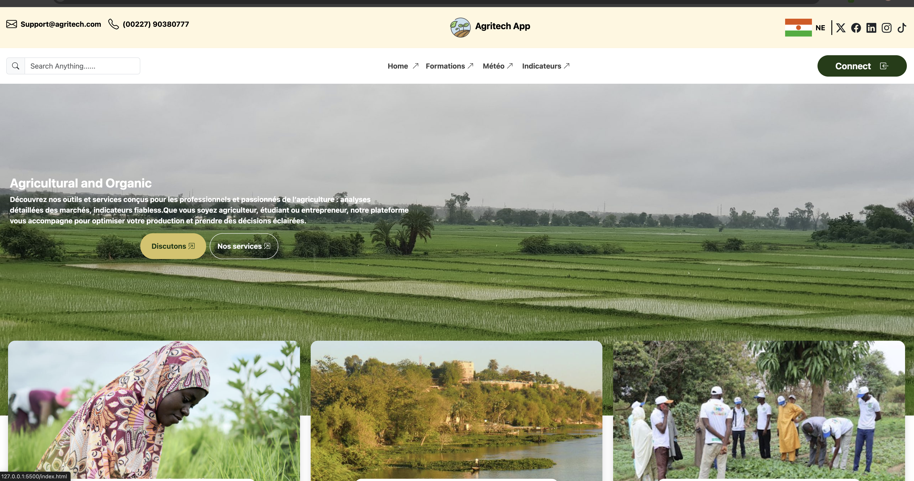
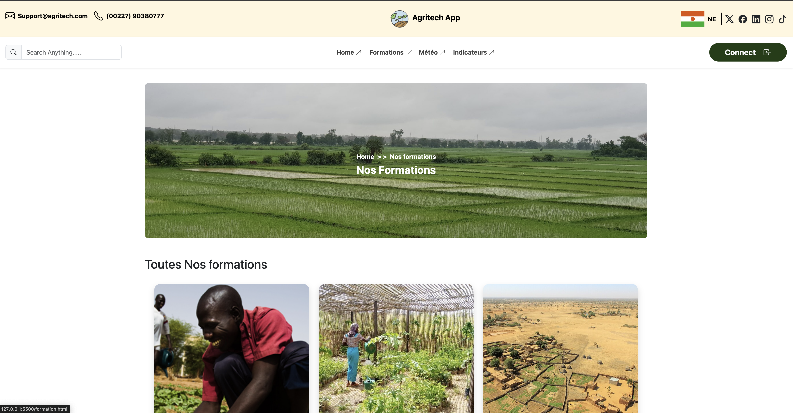
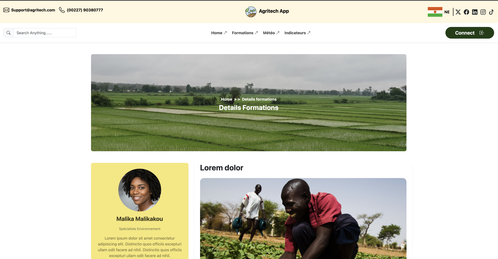

# Agritech App
## Description

- Projet consistant à reproduire une plateforme agricole proposant des formations pour les agriculteurs, en utilisant principalement un framework CSS.

## Objectifs

* Créer une interface proche d’un site réel

* Utiliser au minimum 80% de classes provenant d’un framework CSS

* Reproduire le design présenté dans la vidéo de démonstration

## Technologies

HTML

Framework CSS (Bootstrap)

CSS (utilisation minimale)

* Home capture

* formation capture

* voir capture
